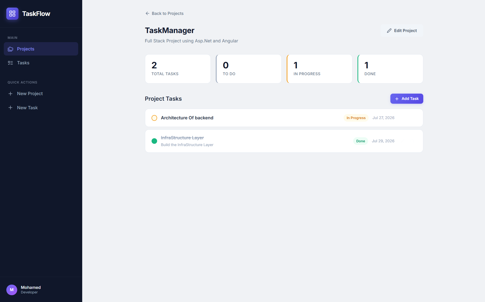
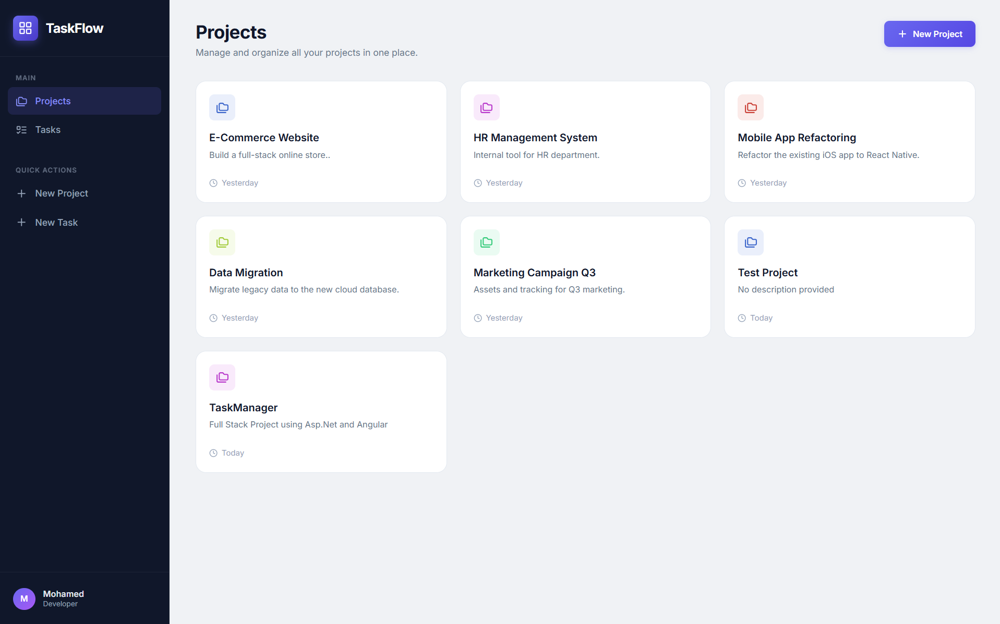
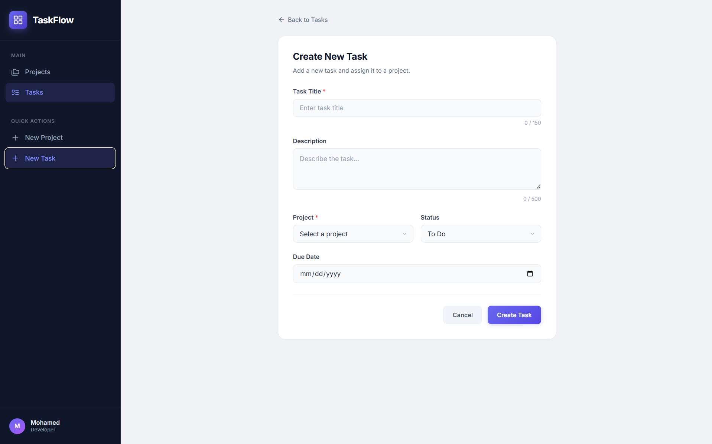
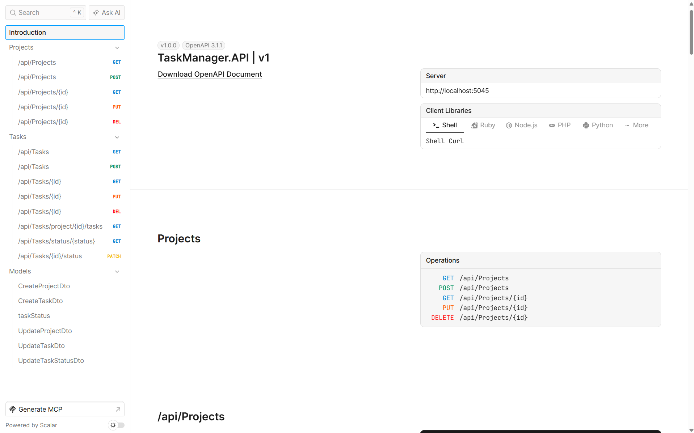

# TaskFlow — Task Manager

<p align="center">
  
</p>

<p align="center">
  
  
  
  
  
</p>

TaskFlow is a full-stack task management application built as a technical assessment for **ElectroPi** using **ASP.NET Core 10**, **Angular 21**, and **SQL Server**. It provides a robust, secure, and beautiful interface for managing projects, tasks, and users.

## 🎥 Demo

A short demo of the application:

**Google Drive:** <https://drive.google.com/file/d/1vYAKp-Z_r9NrNsjA6WebD17uBn6DWEbJ/view?usp=sharing>

## Features

### Core Features
- Create, list, view, edit, and delete **projects**
- Create, list, view, edit, and delete **tasks**
- Change task status directly
- Filter tasks by status
- View a project with its related tasks

### Security & Authentication (New! 🚀)
- **ASP.NET Core Identity** integration with JWT token authentication.
- **Role-based Access Control (RBAC):** `Admin` and `User` roles.
- **Data Isolation:** Users can only view and manage their own projects and tasks.
- **Admin Dashboard:** Admins can manage all registered users, change roles, and deactivate accounts.
- **Route Guards & Interceptors:** Secure frontend routes and automatically attach JWT tokens to API requests.

### UI / UX Enhancements (New! ✨)
- Dynamic sidebar navigation based on user roles.
- Premium design aesthetics with smooth animations, custom scrollbars, and modern typography.
- Enhanced empty states with subtle floating animations.
- Custom bounce-scale loading indicators.
- Seamless, pure CSS-driven sidebar transitions.

## Screenshots

### Projects List
<p align="center">
  
</p>

### Project Details
<p align="center">
  
</p>

### Task Form
<p align="center">
  
</p>

### Scalar API
<p align="center">
  
</p>

## Tech Stack

- **Backend:** ASP.NET Core 10, C#
- **Identity:** ASP.NET Core Identity, JWT Bearer Authentication
- **ORM:** Entity Framework Core 10 (Code First)
- **Database:** SQL Server
- **Validation:** FluentValidation
- **Mapping:** AutoMapper
- **API Docs:** Scalar.AspNetCore
- **Frontend:** Angular 21, TypeScript
- **Styling:** CSS
- **Containerization:** Docker

## Architecture

The backend follows a **simplified Clean Architecture** with a modular monolith structure:

- **TaskManager.API** — controllers, middleware, startup, and JWT configuration
- **TaskManager.Core** — entities, DTOs, services, validators, shared models, Identity models (`AppUser`, `AppRole`)
- **TaskManager.Infrastructure** — DbContext, repositories, configurations, migrations, seed data

Projects, Tasks, and Identity are separated by feature, making the codebase easy to maintain and straightforward to split later if needed.

## API Overview

Base URL: `http://localhost:5045/api`

### Account / Identity
- `POST /Account/register`
- `POST /Account/login`

### Admin
- `GET /Admin/users`
- `PUT /Admin/users/{id}/role`
- `PUT /Admin/users/{id}/status`
- `DELETE /Admin/users/{id}`

### Projects
- `GET /Projects`
- `GET /Projects/{id}`
- `GET /Projects/{id}/tasks`
- `POST /Projects`
- `PUT /Projects/{id}`
- `DELETE /Projects/{id}`

### Tasks
- `GET /Tasks`
- `GET /Tasks/{id}`
- `GET /Tasks/status/{status}`
- `POST /Tasks`
- `PUT /Tasks/{id}`
- `PATCH /Tasks/{id}/status`
- `DELETE /Tasks/{id}`

Scalar API documentation is available at:

`http://localhost:5045/scalar/v1`

## Setup

### Prerequisites

- .NET 10 SDK
- Node.js 18+
- SQL Server or LocalDB
- Angular CLI

### Backend

Update the connection string and JWT settings in `appsettings.json`, then run:

```bash
cd Backend/TaskManager.API/TaskManager.API
dotnet run
```

The database is migrated automatically on startup, and roles/users are seeded.

#### Default Credentials (Seed Data)
The application automatically creates the following accounts on first run:

- **Admin Account**
  - **Email:** `admin@taskflow.com`
  - **Password:** `Admin@123`
  - **Role:** `Admin` (Can manage users)

- **Demo User Account**
  - **Email:** `demo@taskflow.com`
  - **Password:** `Demo@123`
  - **Role:** `User` (Pre-loaded with sample projects and tasks)

### Frontend

```bash
cd FrontEnd/task-Manager-ui
npm install
npm start
```

The frontend runs on `http://localhost:4200`.

### Docker

```bash
cd Backend/TaskManager.API
docker build -f TaskManager.API/Dockerfile -t taskmanager-api .
docker run -p 5045:8080 taskmanager-api
```

## Design Decisions

- ASP.NET Core Identity for robust authentication.
- Feature-based organization for Projects, Tasks, and Users.
- Repository + Service pattern to keep controllers thin.
- FluentValidation for expressive validation rules.
- Result pattern for consistent service responses.
- Angular standalone components for a simpler frontend structure.
- Global exception middleware for centralized error handling.


